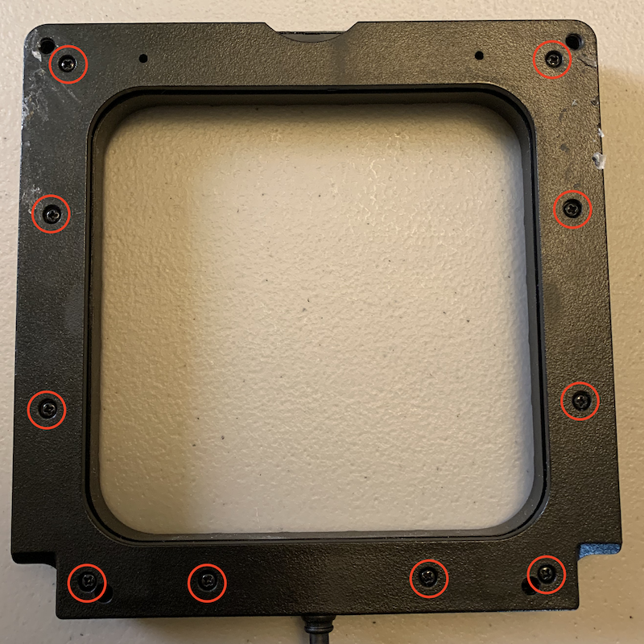
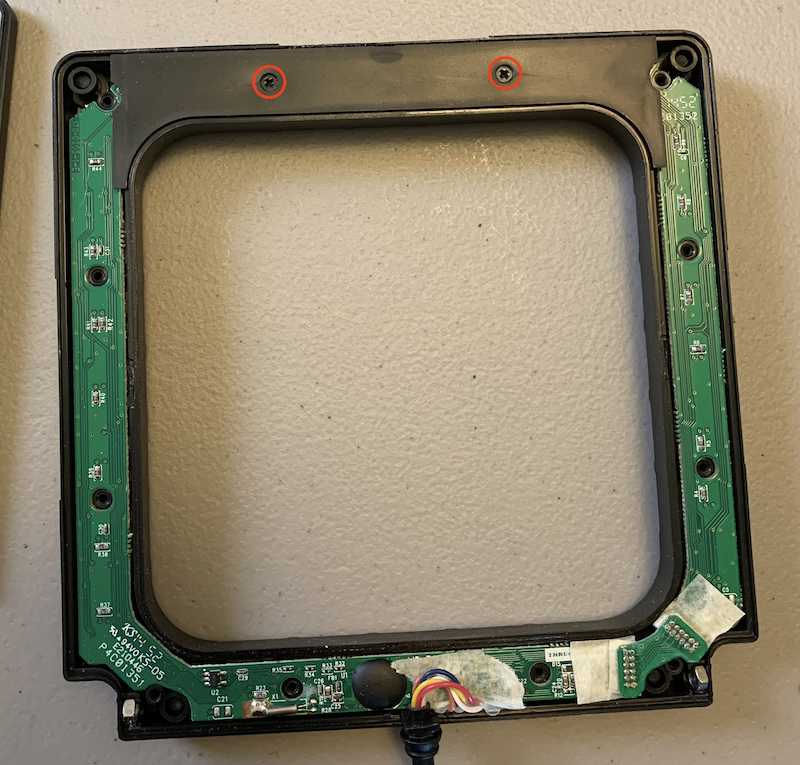
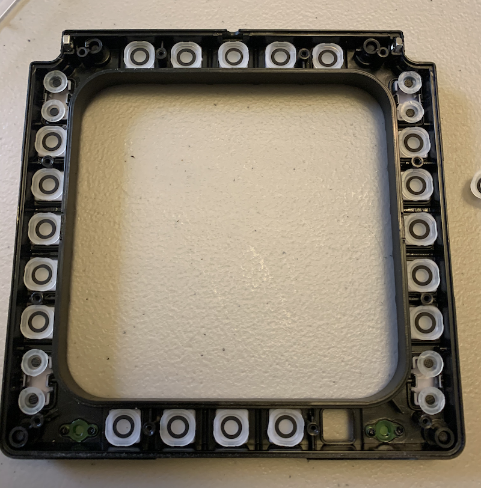
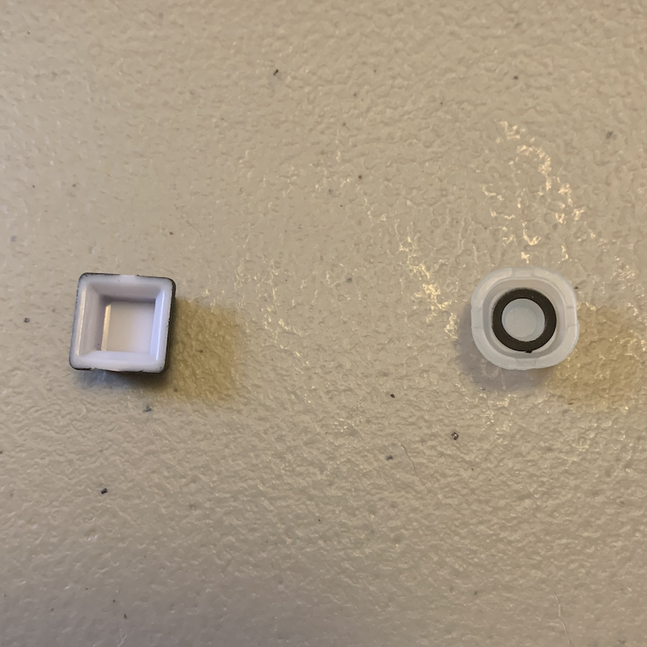
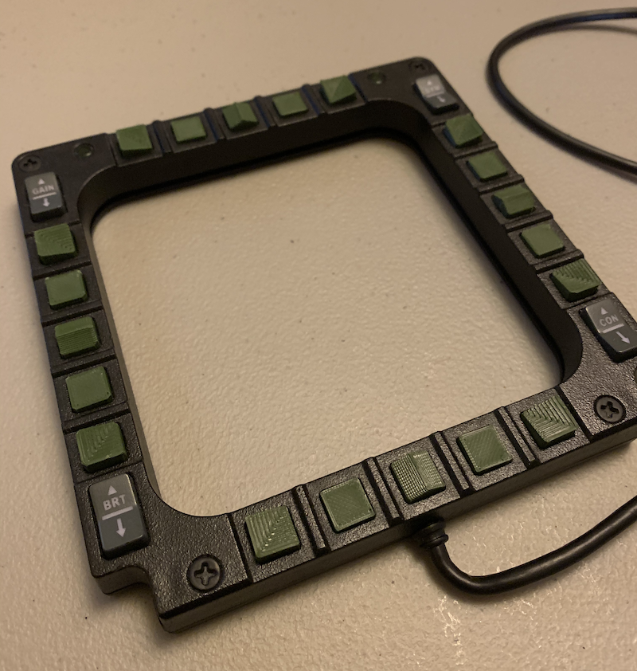

# Thrustmaster Cougar MFD VR Button Cap Replacements

Author: Shadowmouse
Last Update: 2020-08-20

VR Friendly Replacement Button Caps for the Thrustmaster Cougar MFD

# About

I love flying in VR. I also love flying with button boxes and a HOTAS. While the HOTAS is generally VR compatible my trusty Thrustmaster Cougar MFD's are most decidedly NOT. I found it really hard to make sure I was pushing the right buttons so I thought to myself "Hmm, some textured button caps for VR flying would be REALLY nice." I also wanted a 3rd MFD without paying 90 bucks for a pair of them but thats another project. Fortunately my trusty screwdriver and calipers were able to help me gently disassemble the Thrustmaster Cougar's I had and do some exploring. Turns out the guys at TM made some design decisions that made my job REALLY easy. The button caps for the MFD's ended up being little plastic caps floating over a set of silicon button tops. Easy peasy to remove and replicated in your favorite CAD package. A few test prints later and I had VR friendly button caps for the MFD's.

# Instructions

## Printing

If you have a Prusa MK3S then you're in luck. In the "Prints" folder there's a g-code file that will get you on your way. Takes about an hour print for 1 set of 20 button caps. If you don't, check out the STL folder for the original files. You'll need to print the following (1 set per MFD so you'll need to print it twice): 

4 x Center.stl
8 x Flat.stl
8 x Corner.stl

## Assembly

You will need:

- 1 Small Phillips Head Screw Driver
- 1 Small container to hold screws
- 1 Small container to hold the original button caps (for storage)
- 1 Set of replacement printed button caps.

### -- Steps --

1. Remove all 10 screws from the back of the MFD. Store them in one of the containers. Be careful, these are cheap screws and you WILL strip them if you use too much force. I recommend doing this by hand.

2. Remove the 2 screws from the top holder. Same warning applies.

3. Carefully pull out the PCB. Be careful with the cable, it has some glue strain relief but not much.
4. Remove all the buttons from the front face of the MFD. DO NOT REMOVE THE ROCKER BUTTONS IN THE CORNERS.

5. Transfer the silicon button "liners" from the original MFD buttons to the backs of the new printed buttons

6. Put all the buttons back.
    Recommended Order
        A. Center Buttons
        B. Flat Buttons
        C. Corner Buttons
7. Replace the PCB with the button side down.
8. Take care to reseat the cable and replace the back.
9. Put the inner top holder back and screw it down. Be careful, these are cheap screws and you WILL strip them if you use too much force. I recommend doing this by hand.
10. Replace the back of the MFD and screw it down. Be careful, these are cheap screws and you WILL strip them if you use too much force. I recommend doing this by hand.
11. Congratulations, you're done.
